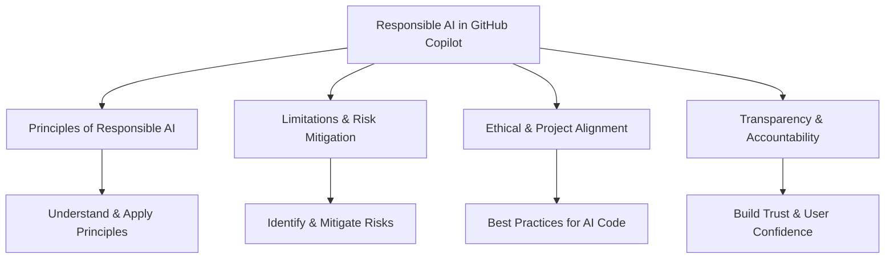
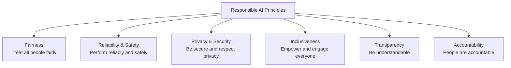

# Introduction

Welcome, we are going to explore the responsible AI in the context of GitHub Copilot, which is a generative AI tool used by developers. At the end of this study you should be able to explain:

---

# Mitigate AI risks

- AI offers innovation but poses risks like lack of transparency, accountability, bias, and privacy issues.
- Mitigate risks by using strong governance, ensuring transparency, and keeping human oversight.
- Responsible AI means designing and using AI safely, ethically, and with fairness, reliability, and transparency.
- Always keep people’s goals and values central in AI system decisions.

---

# Microsoft and GitHub's six principles of responsible AI

image 0

These principles are:

Now, let's explore each of these principles in greater detail to understand how they guide responsible AI practices.

## Fairness: AI systems should treat all people fairly

- AI must treat everyone fairly, giving consistent results to similar groups (e.g., medical, loans, jobs).
- Fairness is promoted by:
  - Reviewing training data for bias
  - Testing with balanced demographics
  - Using debiasing techniques
  - Monitoring performance across groups
  - Overriding unfair scores
- Diverse, balanced data helps reduce bias and supports fairness.

## Reliability and safety: AI systems should perform reliably and safely

- AI must be reliable, safe, and consistent to build trust.
- Reliable: Performs as intended, without errors or unpredictable behavior.
- Safe: Minimizes unintended harm (physical, emotional, financial).
- Systems should handle unexpected conditions and resist manipulation.
- Robust, accurate, and predictable performance is key.

## Privacy and security: AI systems should be secure and respect privacy

- Privacy and security are core to Responsible AI.
- Get user consent before collecting data; explain usage clearly.
- Collect only necessary data; remove sensitive info regularly.
- Anonymize data using pseudonymization and aggregation.
- Encrypt sensitive data in transit and at rest with strong methods.
- Use secure key storage (HSMs, Azure vaults, envelope encryption).
- Limit access, rotate keys, back up securely, classify data, and audit regularly.

## Inclusiveness: AI systems should empower everyone and engage people

- Inclusiveness means AI is fair, accessible, and empowers everyone.
- AI must work well for all users, regardless of background, ability, or location.
- Design with input from diverse communities.
- Ensure accessibility (e.g., screen readers, voice control).
- Support global use: different languages, local contexts, offline/low-resource environments.
- Everyone should benefit equally from AI systems.

## Transparency: AI systems should be understandable

- Transparency means AI systems must be understandable and explainable.
- Clearly explain how AI works and justify design choices.
- Be honest about AI’s capabilities and limitations.
- Enable auditability with logging, reporting, and audits.
- Transparency builds trust, accountability, fairness, safety, and inclusiveness.
- Use documentation, explanatory interfaces, dashboards, and audit tools to support transparency.

## Accountability: People should be accountable for AI systems

- Accountability means AI creators are responsible for their systems’ actions and impacts.
- Continuously monitor AI performance and address risks.
- Without accountability, AI can cause harm and lack oversight.
- Microsoft’s Responsible AI Standard makes accountability foundational—companies must take responsibility for their AI systems.
