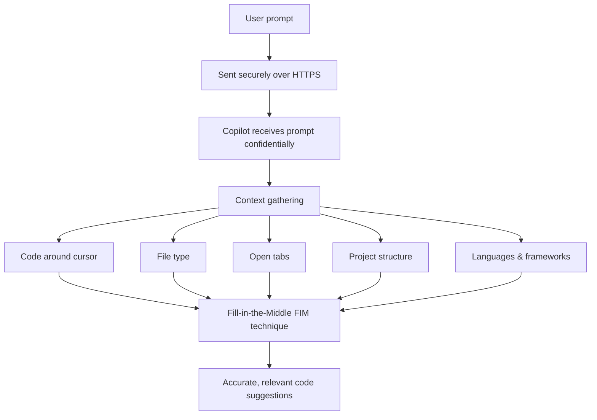
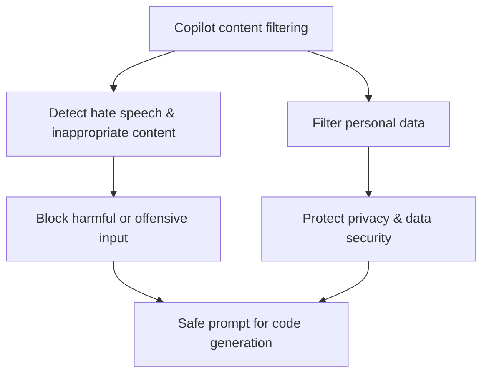
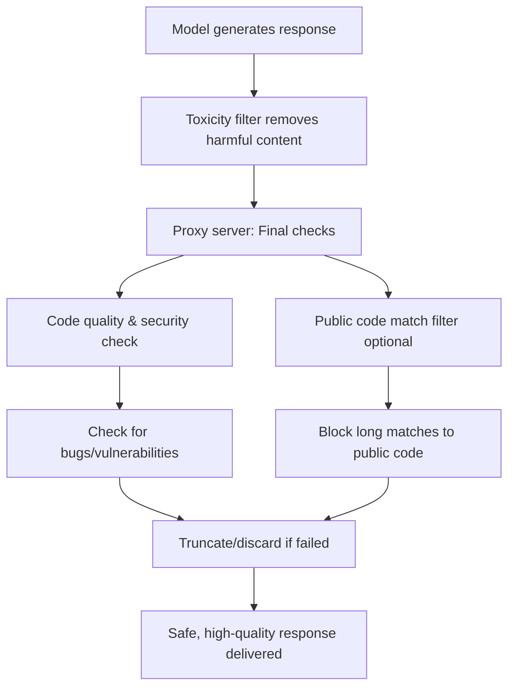

# Introduction

- GitHub Copilot uses AI trained on code and natural language to give smart, context-aware code suggestions.
- Prompt engineering is key: clear, precise prompts lead to better, faster results.
- Learn prompt principles, best practices, and advanced strategies (like role prompting and chat history).
- Understand how Copilot processes prompts, generates suggestions, and manages data securely.
- Effective prompts help you get relevant code with fewer revisions, boosting development speed.

---

## What is prompt engineering?

Prompt engineering is the process of crafting clear instructions to guide AI systems, like GitHub Copilot, to generate context-appropriate code tailored to your project's specific needs. This ensures the code is syntactically, functionally, and contextually correct.

## Principles of prompt engineering

Before we explore specific strategies, let's first understand the basic principles of prompt engineering, summed up in the **4 Ss** below. These core rules are the basis for creating effective prompts.

- **Single**: Always focus your prompt on a single, well-defined task or question. This clarity is crucial for eliciting accurate and useful responses from Copilot.
- **Specific**: Ensure that your instructions are explicit and detailed. Specificity leads to more applicable and precise code suggestions.
- **Short**: While being specific, keep prompts concise and to the point. This balance ensures clarity without overloading Copilot or complicating the interaction.
- **Surround**: Utilize descriptive filenames and keep related files open. This provides Copilot with rich context, leading to more tailored code suggestions.

These core principles lay the foundation for crafting efficient and effective prompts. Keeping the 4 Ss in mind, let's dive deeper into advanced best practices that ensure each interaction with GitHub Copilot is optimized.

## Best practices in prompt engineering

The following advanced practices, based on the 4 Ss, refine and enhance your engagement with Copilot, ensuring that the generated code isn't only accurate but perfectly aligned with your project's specific needs and contexts.

### Provide enough clarity

Building on the 'Single' and 'Specific' principles, always aim for explicitness in your prompts. For instance, a prompt like "Write a Python function to filter and return even numbers from a given list" is both single-focused and specific.

<kbd>
  
</kbd>

### Provide enough context with details

Enrich Copilot's understanding with context, following the 'Surround' principle. The more contextual information provided, the more fitting the generated code suggestions are. For example, by adding some comments at the top of your code to give more details to what you want, you can give more context to Copilot to understand your prompt, and provide better code suggestions.

<kbd>
  
</kbd>

### Provide examples for learning

Using examples can clarify your requirements and expectations, illustrating abstract concepts and making the prompts more tangible for Copilot. Well-crafted examples help Copilot understand patterns quickly, leading to more accurate initial suggestions that require fewer revision cycles. This approach is particularly effective for generating boilerplate code, test templates, and repetitive implementations that form the foundation of larger features.

<kbd>
  
</kbd>

### Assert and iterate

One of the keys to unlocking GitHub Copilot's full potential and accelerating your development workflow is the practice of strategic iteration. Your first prompt might not always yield production-ready code, and that's perfectly fine. Rather than spending time manually refining the output, treat it as the beginning of an efficient dialogue with Copilot.

If the first output isn't quite what you're looking for, don't start from scratch. Instead, erase the suggested code, enrich your initial comment with added details and examples, and prompt Copilot again. This iterative approach often gets you to high-quality, deployment-ready code faster than traditional development methods, as each iteration builds on Copilot's understanding of your specific requirements.

## How Copilot learns from your prompts

GitHub Copilot operates based on AI models trained on vast amounts of data. To enhance its understanding of specific code contexts, engineers often provide it with examples. This practice, commonly found in machine learning, led to different training approaches such as:

### Zero-shot learning

GitHub Copilot generates code without any specific examples, relying solely on its foundational training. This approach is ideal for rapidly implementing common patterns and standard functionality. For instance, suppose you want to create a function to convert temperatures between Celsius and Fahrenheit. You can start by only writing a comment describing what you want, and Copilot might be able to generate production-ready code for you, based on its previous training, without any other examples.

<kbd>
  
</kbd>

### One-shot learning

With this approach, a single example is given, aiding the model in generating more context-aware responses that follow your specific patterns and conventions. This is particularly effective for creating consistent implementations across your codebase, accelerating feature development while maintaining code standards. Building upon the previous zero-shot example, you might provide an example of a temperature conversion function and then ask Copilot to create another similar function. Here's how it could look:

<kbd>
  
</kbd>

### Few-shot learning

In this method, Copilot is presented with several examples, which strike a balance between zero-shot unpredictability and the precision of fine-tuning. This approach excels at generating sophisticated implementations that handle multiple scenarios and edge cases, reducing the time spent on manual testing and refinement. Let's say you want to generate code that sends you a greeting depending on the time of the day. Here's a few-shot version of that prompt:

<kbd>
  
</kbd>

### Chain prompting and managing chat history

- Chain prompting means building on previous chat turns for complex tasks.
- Long chat histories can slow down Copilot and increase costs.
- To manage efficiently:
  - Summarize context when chats get long.
  - Reset and give focused context for new features.
  - Refer concisely to earlier work instead of repeating everything.

## Role prompting for specialized tasks

Role prompting involves instructing GitHub Copilot to act as a specific type of expert, which can significantly improve the quality and relevance of generated code for specialized domains. This approach helps accelerate development by getting more targeted solutions on the first try.

### Security expert role

When working on security-critical features, prompt Copilot to think like a security expert:

"Act as a cybersecurity expert. Create a password validation function that checks for common vulnerabilities and follows OWASP guidelines."

This approach typically generates code that includes:

- Input sanitization
- Protection against common attacks
- Industry standard validation patterns
- Security best practices

### Performance optimization role

For performance-critical code, use a performance expert role:

"Act as a performance optimization expert. Refactor this sorting algorithm to handle large datasets efficiently."

This often results in:

- Optimized algorithms and data structures
- Memory-efficient implementations
- Scalability considerations
- Performance monitoring suggestions

### Testing specialist role

When creating comprehensive test suites, leverage a testing expert perspective:

"Act as a testing specialist. Create comprehensive unit tests for this payment processing module, including edge cases and error scenarios."

This typically produces:

- Thorough test coverage
- Edge case handling
- Mock implementations
- Error condition testing

Role prompting helps you get production-ready code faster by incorporating domain expertise into initial implementations, reducing the need for multiple revision cycles.

## Inbound flow:

<kbd>
  
</kbd>

---

Let's walk through all the steps Copilot takes to process a user's prompt into a code suggestion.

### 1. Secure prompt transmission and context gathering

### 2. Proxy filter

Once the context is gathered and the prompt is built, it passes securely to a proxy server hosted in a GitHub-owned Microsoft Azure tenant. The proxy filters traffic, blocking attempts to hack the prompt or manipulate the system into revealing details about how the model generates code suggestions.

### 3. Toxicity filtering

Copilot incorporates content filtering mechanisms before proceeding with intent extraction and code generation, to ensure that the generated code and responses don't include or promote:

### 4. Code generation with LLM

Finally, the filtered and analyzed prompt is passed to LLM Models, which generate appropriate code suggestions. These suggestions are based on Copilot’s understanding of the prompt and the surrounding context, ensuring that the generated code is relevant, functional, and aligned with project-specific requirements.

---

## Outbound Flow:

<kbd>
  
</kbd>

---

### 5. Post-processing and response validation

Once the model produces its responses, the toxicity filter removes any harmful or offensive generated content. The proxy server then applies a final layer of checks to ensure code quality, security, and ethical standards. These checks include:

### 6. Suggestion delivery and feedback loop initiation

Only responses that pass all filters are delivered to the user. Copilot then initiates a feedback loop based on your actions to achieve the following:

- Grow its knowledge from accepted suggestions.
- Learn and improve through modifications and rejections of its suggestions.

### 7. Repeat for subsequent prompts

The process is repeated as you provide more prompts, with Copilot continuously handling user requests, understanding their intent, and generating code in response. Over time, Copilot applies the cumulative feedback and interaction data, including context details, to improve its understanding of user intent and refine its code generation capabilities.

---

# GitHub Copilot data

Now let us learn how GitHub Copilot handles data for different environments, feature and configurations.

## Data handling for GitHub Copilot code suggestions

GitHub Copilot in the code editor does not retain any prompts like code or other context used for the purposes of providing suggestions to train the foundational models. It discards the prompts once a suggestion is returned.

GitHub Copilot Individual subscribers can opt-out of sharing their prompts with GitHub which will otherwise be used to finetune GitHub’s foundational model.

## Data handling for GitHub Copilot chat

GitHub Copilot Chat operates as an interactive platform, allowing developers to engage in conversational interactions with the AI assistant to receive coding assistance. Here are the steps that it carries out which might be distinct from other features like code completion:

- **Formatting**: Copilot meticulously formats the generated response for optimal presentation within the chat interface. It highlights code snippets to improve readability and may include options for direct integration into your code. Copilot showcases the formatted response in the Copilot Chat window within the IDE, allowing you to easily review and interact with the provided information.
- **User engagement**: You can actively engage with the response by asking follow-up questions, requesting clarifications, or providing additional input. The chat interface maintains a conversation history to facilitate contextual understanding in subsequent interactions.
- **Data retention**: For Copilot Chat used outside the code editor, GitHub typically retains prompts, suggestions, and supporting context for 28 days. Specific retention policies for Copilot Chat within the code editor may vary.

The same goes for CLI, Mobile, and GitHub Copilot Chat on GitHub.com.

## Prompt types supported by GitHub Copilot Chat

GitHub Copilot Chat processes a wide range of coding-related prompts, demonstrating its versatility as a conversational coding assistant. Here are some common input types:

- **Direct Questions**: You can ask specific questions about coding concepts, libraries, or troubleshooting issues. For example, "How do I implement a quick sort algorithm in Python?" or "Why is my React component not rendering?"
- **Code-Related Requests**: You can request code generation, modification, or explanation. Examples include "Write a function to calculate factorial," "Fix this error in my code," or "Explain this code snippet."
- **Open-Ended Queries**: You can explore coding concepts or seek general guidance by asking open-ended questions like "What are the best practices for writing clean code?" or "How can I improve the performance of my Python application?"
- **Contextual Prompts**: You can provide code snippets or describe specific coding scenarios to seek tailored assistance. For instance, "Here's a part of my code, can you suggest improvements?" or "I'm building a web application, can you help me with the authentication flow?"

Copilot Chat's ability to process diverse input types enhances its utility as a comprehensive coding companion.

## Limited context windows

<kbd>
  
</kbd>

---

- Copilot’s context window limits how much code/text it can process at once (about 200–500 lines or a few thousand tokens).
- Copilot Chat has a larger context window (4k tokens), allowing broader understanding.
- To get better results, break complex problems into smaller prompts and provide relevant code snippets.

---

# GitHub Copilot Large Language Models (LLMs)

Now we focus on understanding the integration and impact of LLMs in GitHub Copilot.

## What are LLMs?

Large Language Models (LLMs) are artificial intelligence models designed and trained to understand, generate, and manipulate human language. These models are ingrained with the capability to handle a broad range of tasks involving text, thanks to the extensive amount of text data they're trained on. Here are some core aspects to understand about LLMs:

### Volume of training data

LLMs are exposed to vast amounts of text from diverse sources. This exposure equips them with a broad understanding of language, context, and intricacies involved in various forms of communication.

### Contextual understanding

They excel in generating contextually relevant and coherent text. Their ability to understand context allows them to provide meaningful contributions, be it completing sentences, paragraphs, or even generating whole documents that are contextually apt.

### Machine learning and AI integration

LLMs are grounded in machine learning and artificial intelligence principles. They're neural networks with millions, or even billions, of parameters that are fine-tuned during the training process to understand and predict text effectively.

### Versatility

These models aren't limited to a specific type of text or language. They can be tailored and fine-tuned to perform specialized tasks, making them highly versatile and applicable across various domains and languages.

## Role of LLMs in GitHub Copilot and prompting

GitHub Copilot utilizes LLMs to provide context-aware code suggestions. The LLM considers not just the current file but also other open files and tabs in the IDE to generate accurate and relevant code completions. This dynamic approach ensures tailored suggestions, improving your productivity.

## Fine-tuning LLMs

Fine-tuning is a critical process that allows us to tailor pretrained large language models (LLMs) for specific tasks or domains. It involves training the model on a smaller, task-specific dataset, known as the target dataset, while using the knowledge and parameters gained from a large pretrained dataset, referred to as the source model.

<kbd>
  
</kbd>

Fine-tuning is essential to adapt LLMs for specific tasks, enhancing their performance. However, GitHub took it a step further by using the LoRA fine tuning method, which we discuss next.
